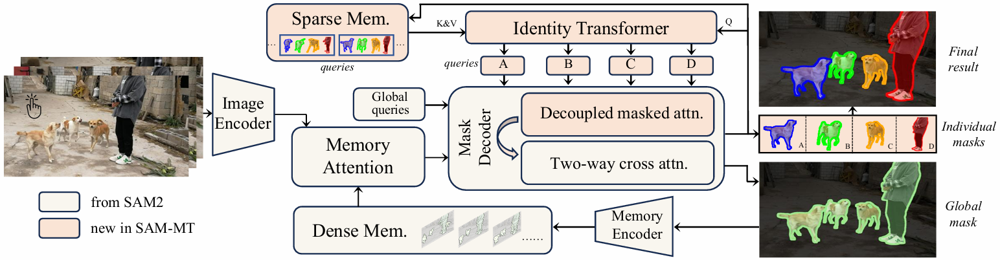
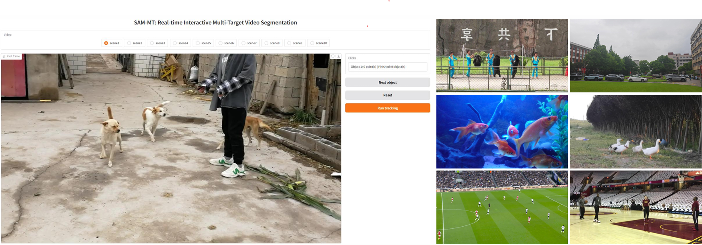

<h1 align="center">
SAM-MT: Real-Time Interactive Multi-Target Video Segmentation
</h1>

<p align="center">
  <strong>Ruiqi Shen</strong><sup style="font-size: 0.7em;">1</sup>
  ·
  <a href="https://scholar.google.com/citations?user=XlQP0GIAAAAJ&hl=zh-CN"><strong>Chang Liu</strong></a><sup style="font-size: 0.7em;">2✉️</sup>
  ·
  <a href="https://henghuiding.com/"><strong>Henghui Ding</strong></a><sup style="font-size: 0.7em;">1✉️</sup>
</p>

<p align="center">
  <sup>1</sup>Fudan University &nbsp;&nbsp;
  <sup>2</sup>Shanghai University of Finance and Economics  &nbsp;
</p>

<p align="center">
  <a href="https://henghuiding.com/SAM-MT/"></a>
  <a href="https://arxiv.org/abs/2607.08688"></a>
  <a href="https://huggingface.co/FudanCVL/SAM-MT"></a>
</p>

<p align="center">
  <strong>SAM-MT</strong> is an efficient <strong>interactive</strong> multi-target video segmentation framework that maintains <strong>near-single-object</strong> efficiency (FPS and VRAM) as target count increases, while maintaining robust video segmentation performance.
</p>

<p align="center">
  
</p>

## ✨ Highlights
* **Real-time speed**: 36+ FPS with 10 targets on a single NVIDIA RTX A6000 GPU.
* **Individual-global representation**: Models individual targets and global scene within a unified framework.
* **Interactive multi-target video segmentation**: Simple clicks for target specification.

## 📋 TODO
- ✅ Release checkpoint of SAM-MT.
- ✅ Release inference code and interactive demo.
- ⬜ Enhance negative-click refinement.
- ⬜ Release training code.

## 🧠 Checkpoint

We provide the official SAM-MT checkpoint for real-time interactive multi-target video segmentation.

<table>
  <thead>
    <tr>
      <th>Model</th>
      <th>Checkpoint</th>
    </tr>
  </thead>
  <tbody>
    <tr>
      <td>SAM-MT</td>
      <td>
        <a href="https://huggingface.co/FudanCVL/SAM-MT/tree/main/checkpoints">
          
        </a>
      </td>
    </tr>
  </tbody>
</table>

By default, place the checkpoint under the `checkpoints/` directory.


## ⚙️ Installation
```bash
# clone the repo and enter directory
git clone https://github.com/FudanCVL/SAM-MT.git
cd SAM-MT

# create and activate conda environment
conda create -n sammt python=3.10 -y
conda activate sammt

# install required packages
pip install -r requirements.txt
```

## 🧪 Evaluation

The evaluation-related files are organized as follows:

```bash
SAM-MT/
├── demo/
│   ├── points/
│   └── synthetic_benchmark/
└── evaluation/
    ├── evaluate_efficiency.py # Efficiency evaluation (FPS & VRAM)
    ├── evaluate_mose.py       # MOSE evaluation
    └── evaluate_lvos.py       # LVOS evaluation (supports targets appearing later)
```

## 🚀 Inference

We provide two inference scripts for SAM-MT:

```bash
# Basic inference (coordinates required)
python inference.py

# Interactive Gradio demo
python inference_gradio.py
```

For quick exploration, we recommend the Gradio demo, where users can directly click on the targets and try the model:
<div align="center" style="margin-top: -1.5em;">  </div>


## 📚 Acknowledgements & Citation

We are inspired by the excellent work of [SAM2](https://github.com/facebookresearch/sam2), and many other not listed.

If you find SAM-MT useful in your research, please consider citing:

```bibtex
@inproceedings{SAM-MT,
  title={{SAM-MT}: Real-Time Interactive Multi-Target Video Segmentation},
  author={Shen, Ruiqi and Liu, Chang and Ding, Henghui},
  booktitle={European Conference on Computer Vision (ECCV)},
  year={2026}
}
```
